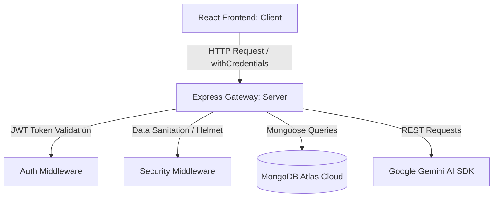

# CareerHub Portal — Root Guide

This is a MERN-stack application containing two separate directories:

1. **`careerhub-backend`**: Node.js + Express API server (runs on port `5001` and connects to MongoDB Atlas).
2. **`careerhub`**: React + Vite + Tailwind CSS frontend application (runs on port `5173`).

---

## ⚠️ Important note on command execution

The root directory `projectLPU` is just a container folder and **does not contain a `package.json` file**.
Running `npm run dev` or `npm install` directly in this root directory will result in an `npm error ENOENT`.

You must always navigate (`cd`) into either the `careerhub` or `careerhub-backend` directory before running your scripts.

---

## How to Run the Project (Quick Start)

### 1. Start the Backend API Server

Open a terminal window and run:

```bash
cd careerhub-backend
npm run dev
```

- Server will listen on **[http://localhost:5001](http://localhost:5001)**.
- Connects automatically to the cloud MongoDB Atlas database via `.env` credentials.

### 2. Start the Frontend React App

Open a **second** terminal window and run:

```bash
cd careerhub
npm run dev
```

- Frontend will be hosted on **[http://localhost:5173](http://localhost:5173)**.

### 3. Seed Sample Data (Employers, Candidates, Jobs & Admin)

Reset and populate the database with realistic mock data:

```bash
cd careerhub-backend
node scripts/seedData.js
```

---

## 🔑 Login Credentials

### System Administrator:

- **URL**: [http://localhost:5173/admin/login](http://localhost:5173/admin/login)
- **Email**: `admin@careerhub.example` | **Password**: `Admin@1234`

### Corporate Recruiter (Employer):

- **Email**: `hr@nimbus.example` | **Password**: `Employer@123`

### Candidate (Student):

- **Email**: `arjun@example.com` | **Password**: `Candidate@123`

---

## 📊 Rubric Criteria & Code Mapping

This table maps each grading criterion directly to our codebase implementation.

| Criterion                               | Target Focus                                                               | Key Implementation Files / Dirs                                                                                                                                                                                                                                                                                        |
| :-------------------------------------- | :------------------------------------------------------------------------- | :--------------------------------------------------------------------------------------------------------------------------------------------------------------------------------------------------------------------------------------------------------------------------------------------------------------------- |
| **1. Problem Understanding & Planning** | Requirement analysis, wireframe mapping, and architectural modules.        | Root [README.md](file:///Users/namanswastiksahu/Documents/Programming%20Stuffs/projectLPU/README.md) & [walkthrough.md](file:///Users/namanswastiksahu/.gemini/antigravity-ide/brain/1c4ae24a-f652-4556-b15d-aa01aa119095/walkthrough.md)                                                                              |
| **2. React UI & User Experience**       | Component hierarchy, state handling, routes, responsive UI, validations.   | [careerhub/src/pages/](file:///Users/namanswastiksahu/Documents/Programming%20Stuffs/projectLPU/careerhub/src/pages/) & [routerpath.jsx](file:///Users/namanswastiksahu/Documents/Programming%20Stuffs/projectLPU/careerhub/src/routes/routerpath.jsx)                                                                 |
| **3. Node.js & Express REST APIs**      | Routes, controllers, HTTP status codes, validation, global error handling. | [careerhub-backend/src/controllers/](file:///Users/namanswastiksahu/Documents/Programming%20Stuffs/projectLPU/careerhub-backend/src/controllers/) & [errorHandler.js](file:///Users/namanswastiksahu/Documents/Programming%20Stuffs/projectLPU/careerhub-backend/src/middleware/errorHandler.js)                       |
| **4. MongoDB Design & CRUD**            | Relational references, text indexes, schema validation, advanced queries.  | [careerhub-backend/src/models/](file:///Users/namanswastiksahu/Documents/Programming%20Stuffs/projectLPU/careerhub-backend/src/models/)                                                                                                                                                                                |
| **5. Core Features & Integration**      | Dashboard, Live Resume Builder, Search Portal, AI Mock Interview.          | [CandidateDashboardPage.jsx](file:///Users/namanswastiksahu/Documents/Programming%20Stuffs/projectLPU/careerhub/src/pages/candidate/CandidateDashboardPage.jsx), [MockInterviewPage.jsx](file:///Users/namanswastiksahu/Documents/Programming%20Stuffs/projectLPU/careerhub/src/pages/candidate/MockInterviewPage.jsx) |
| **6. Code Quality & Security**          | JWT HttpOnly cookies, MongoDB sanitization, rate limits, env variables.    | [auth.js](file:///Users/namanswastiksahu/Documents/Programming%20Stuffs/projectLPU/careerhub-backend/src/middleware/auth.js) & [server.js](file:///Users/namanswastiksahu/Documents/Programming%20Stuffs/projectLPU/careerhub-backend/server.js)                                                                       |
| **7. Testing & Viva**                   | Manual test guides, system setup validation, architectural definitions.    | Viva Prep Section below                                                                                                                                                                                                                                                                                                |

---

## 🏛️ Project Architecture Details



### 1. Problem Understanding & Planning (10 Marks)

- **Objective**: Standardize hiring for Indian freshers by merging resume preparation, direct application boards, and AI mock interview simulations.
- **Architectural Scope**: Separated into a decoupled backend API (`careerhub-backend`) and a client SPA (`careerhub`) to mimic enterprise separation of concerns.

### 2. React UI & User Experience (15 Marks)

- **Routing**: Configured centrally in [routerpath.jsx](file:///Users/namanswastiksahu/Documents/Programming%20Stuffs/projectLPU/careerhub/src/routes/routerpath.jsx) using a `ROUTES` dictionary to avoid hardcoded string links.
- **State Management**: Managed via React context (`AuthContext.jsx`) for login statuses, alongside local component state for dynamic live updates.
- **Responsiveness**: Entirely styled using Tailwind CSS's mobile-first breakpoints (`sm`, `md`, `lg`, `xl`).

### 3. Node.js / Express REST APIs (20 Marks)

- **Controller-Route Pattern**: Decoupled routes (e.g. `jobRoutes.js`) map to controllers containing isolated async handlers (e.g. `jobController.js`).
- **Global Error Handling**: Captured uniformly using [errorHandler.js](file:///Users/namanswastiksahu/Documents/Programming%20Stuffs/projectLPU/careerhub-backend/src/middleware/errorHandler.js) which formats response structures and masks database stack traces.
- **Input Validation**: Utilizes `express-validator` middleware blocks to validate credentials on registration and job postings prior to hitting DB operations.

### 4. MongoDB Design & CRUD (15 Marks)

- **Data Models**:
  - `User`: Handles identity credentials, salted password hashing, and user roles (`candidate`/`employer`/`admin`).
  - `Job`: Models standard vacancy listings, referencing the posting employer `User` document.
  - `Resume`: Connects to a user, storing arrays of education, experience, skills, and projects.
  - `InterviewSession`: Tracks AI interview logs, question-by-question scoring, and final grades.
- **Indexing**: Enabled text search index across `title`, `company`, and `skills` on `Job` collections, and `fullName`, `title`, and `skills` on `Resume` collections.

### 5. Core Features & Integration (15 Marks)

- **Live Resume Builder**: Side-by-side builder. Input fields on the left immediately sync with a premium PDF-style canvas sheet on the right, autosaving fields to MongoDB on submit.
- **Search Resumes Board**: Allows recruiters to execute keyword searches, matching skills against candidates using text search indexes.
- **AI Mock Interview Simulator**: Novel feature allowing candidates to practice role-specific interviews. Questions are generated dynamically by Gemini AI, answers are evaluated/scored on submission, and a report card is saved.
- **CareerBot (Chatbot)**: Floating real-time AI advisor widget utilizing Server-Sent Events (SSE) to stream professional career guidance to users.

### 6. Code Quality, Git & Security (10 Marks)

- **Cookie-based Session Auth**: Stores JWTs in an `httpOnly` cookie rather than `localStorage`, preventing XSS theft.
- **MongoDB Sanitization**: Employs `express-mongo-sanitize` to defend against query injection attacks.
- **Rate Limiting**: Integrated `express-rate-limit` to prevent brute force login attempts.

---

## 💬 Viva & Tech Stack Q&A Prep

Prepare for your project viva with these common interviewer questions and answers based on this project:

#### Q1: Why did you use `httpOnly` cookies instead of storing the JWT in `localStorage`?

> _Answer_: Storing JWTs in `localStorage` makes them accessible to client-side scripts, making the application vulnerable to Cross-Site Scripting (XSS) token theft. `httpOnly` cookies ensure that client-side JavaScript cannot read the token, securing authentication sessions.

#### Q2: Explain how your Live Resume Builder works.

> _Answer_: We bind the form fields to a React state object. As the user typing fires `onChange` handlers, the state updates. A preview component receives this state and renders it in real-time. On clicking save, an API request commits the structured JSON object to the candidate's `Resume` record in MongoDB.

#### Q3: How is the AI Mock Interview evaluation structured?

> _Answer_: The backend queries the Google Gemini API using a system prompt configured to return structured JSON. The JSON contains a score (1-10), contextual feedback, and a model answer. The backend parses this JSON, updates the candidate's `InterviewSession` document, and streams the validation metrics back to the UI.

#### Q4: What is the purpose of CORS credentials: "include" and withCredentials: true?

> _Answer_: Since our frontend runs on port 5173 and backend on port 5001, they are cross-origin. By default, browsers block cross-origin cookies. Setting `withCredentials: true` on Axios and `credentials: true` on backend CORS configuration permits the browser to receive and send the JWT cookie securely.
